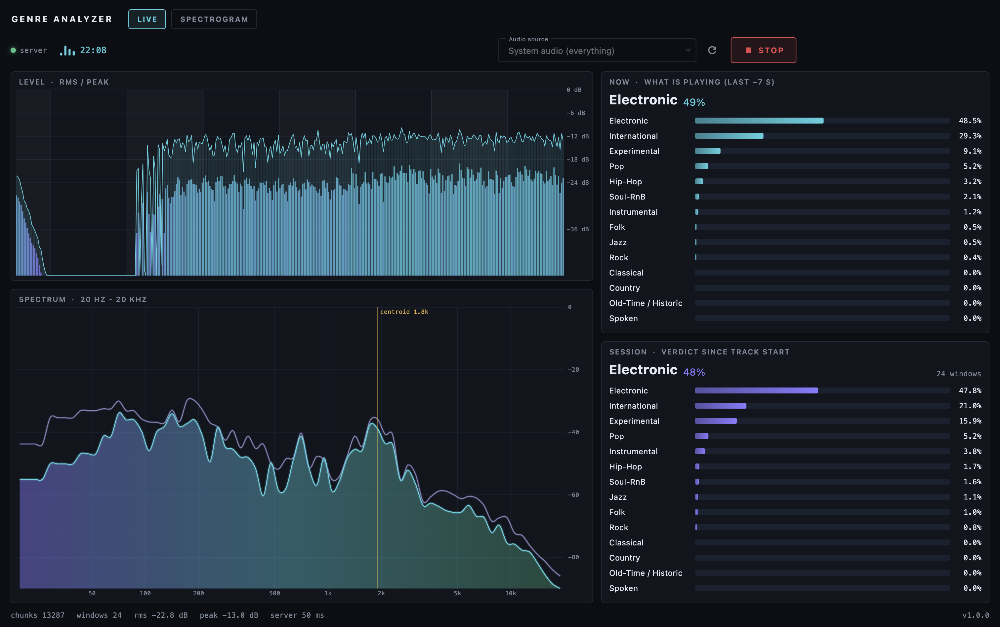
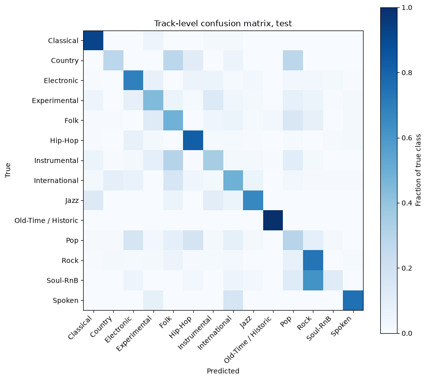
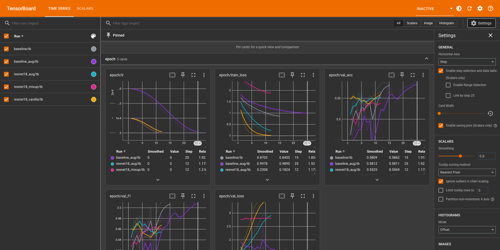

# Genre Analyzer

Live music genre classification on macOS: the app listens to system audio and
shows a real-time probability distribution over 14 genres, plus an aggregated
verdict for the track being played. Capstone project for the Advanced Deep
Learning for AI Applications course (MSc Computer Science).

The pipeline is fully local: a CNN trained on FMA medium, a FastAPI inference
server and a Flutter desktop app. No cloud, no external APIs.



## What is in the repo

- `ml/` - training and experiments. `ml/src` holds the Python scripts
  (preprocessing, dataset, models, training, inference), `ml/notebooks` holds
  the executed analysis notebooks with all plots and conclusions.
- `server/` - local FastAPI inference server.
- `app/` - Flutter desktop app (macOS; Windows/Linux builds compile, see the
  note below).
- `data/` - mostly local-only (the dataset is 23GB), but the repo ships the
  small artifacts needed to run everything without retraining: the final
  model checkpoint (`data/runs/baseline_aug/best.pt`, 1.5MB), training
  curves of every run (`history.csv`), the track index with labels
  (`data/spectrograms/index.csv`) and five test spectrogram images
  (`data/test_images/`).

## Quick start

Requirements: Python 3.11+; macOS 13+ for live capture. ffmpeg and the
dataset are NOT needed to run the app - the trained checkpoint is in the
repo. One command sets up the Python venv, launches the app (prebuilt bundle
if present, otherwise builds it - needs [Flutter](https://flutter.dev)) and
starts the inference server:

```bash
git clone https://github.com/Nyt1k/audio-genre-analyzer.git
cd audio-genre-analyzer
./scripts/run.sh                                        # macOS / Linux
powershell -ExecutionPolicy Bypass -File scripts\run.ps1   # Windows
```

To skip building from source, download the app archive for your OS from
[GitHub Releases](https://github.com/Nyt1k/audio-genre-analyzer/releases)
and unzip it into the path the script prints. On macOS also remove the
quarantine flag first (the app is not notarized):
`xattr -dr com.apple.quarantine "Genre Analyzer.app"`.

First capture start on macOS: the system asks for the Screen & System Audio
Recording permission. Allow it and restart the app (macOS applies it to new
processes only). If capture is still blocked, the in-app OPEN SETTINGS
button jumps to the right System Settings pane. The app is ad-hoc signed, so
after rebuilding it from source macOS forgets the permission; reset with
`tccutil reset ScreenCapture dev.nytik.genreAnalyzer` and allow again.

In VS Code the stack also starts with one task: `genre: run all`
(or `genre: run all (release)` for the release build).

### Releases

Pushing a `v*` tag builds the app for macOS, Windows and Linux on GitHub
Actions and attaches the archives to the release automatically
(`.github/workflows/release.yml`). Locally, `scripts/release.sh`
(or `scripts/release.ps1` on Windows) builds the current platform into
`dist/`.

## Using the app

**LIVE tab** - pick a source (whole system audio or a single application),
press START and play music:

- level meter with RMS/peak history, dynamics band and 5s window markers -
  the exact chunks the model consumes;
- live spectrum analyzer (FFT, 72 log bands, peak hold, spectral centroid);
- NOW panel: what is playing right now (exponential average, ~7s memory);
- SESSION panel: the aggregated verdict for the current track.

Session semantics: the session verdict is the mean over the last 300 model
windows (~5 minutes) at most. It resets on START, on source change and
automatically on a silence gap (2.5s below -55 dBFS), which in practice
means a new track in any player.

**SPECTROGRAM tab** - feed the model a rendered spectrogram image instead of
audio: pick a png/jpg, the server reconstructs the log-mel array from pixel
brightness and runs the same CNN. Try the samples in `data/test_images/`
(named by their true genre). Plain spectrogram images without axes work best.

## Server API

| Endpoint | Description |
|---|---|
| `POST /audio?sr=<rate>` | body: raw mono float32 PCM chunk. Returns the current window distribution, the recent EMA and the session mean |
| `POST /image` | body: a spectrogram image. Returns the model distribution |
| `POST /reset` | start a new session |
| `GET /status` | model info and session counters |

Configuration via env vars: `GENRE_CHECKPOINT` (default
`data/runs/baseline_aug/best.pt`), `GENRE_DEVICE` (default `cpu` - the model
is small enough that CPU inference takes ~10ms per window).

## ML pipeline

- Dataset: [FMA](https://github.com/mdeff/fma) `medium` subset - 25 000
  30-second track excerpts, 16 top-level genres.
- Class selection: Easy Listening (21 tracks) and Blues (74) dropped as too
  small; Rock (7103) and Electronic (6314) randomly capped to 3000 each
  (seed=42). Result: 14 classes, 17 488 tracks; 11 known-corrupt FMA mp3s are
  skipped during preprocessing, leaving 17 477 spectrograms.
- Train/validation/test split: the official artist-aware split from FMA
  metadata (no artist leakage). Splitting is always by track, never by window.
- Features: log-mel spectrograms - 22 050 Hz mono, 128 mel bins, FFT 2048,
  hop 512, power in dB. One spectrogram per full track (float16 `.npy`);
  slicing into 5s windows happens on the fly in the Dataset.
- Class imbalance (3000 vs ~120 tracks) is handled with class weights in the
  loss, not by discarding data.

## Results

The final model is a small CNN (0.39M parameters) trained from scratch with
SpecAugment. On the held-out test set (1794 tracks, evaluated once):
track-level accuracy 59.4%, macro-F1 0.534, top-3 accuracy 83.8%. All
ResNet18 transfer-learning variants performed worse than the from-scratch
CNN; the full experiment log with plots and conclusions is in
`ml/notebooks/resnet_results.ipynb`, the final test evaluation in
`ml/notebooks/final_evaluation.ipynb`.

Per-class recall on test is extremely uneven: acoustically distinct genres
are recognized reliably, while diffuse categories without a sound of their
own drift into neighboring genres (which is also what the confusion matrix
shows - the errors are semantic, not random):

| best                | recall | worst    | recall |
|---------------------|--------|----------|--------|
| Old-Time / Historic | 1.00   | Soul-RnB | 0.12   |
| Classical           | 0.92   | Country  | 0.28   |
| Hip-Hop             | 0.82   | Pop      | 0.29   |



## Reproducing the training

This is the only part that needs the dataset (~23GB) and ffmpeg
(`brew install ffmpeg`):

```bash
# metadata (~342 MB) - also done automatically by ml/notebooks/data_analyze.ipynb
curl -o data/fma_metadata.zip https://os.unil.cloud.switch.ch/fma/fma_metadata.zip
tar -xf data/fma_metadata.zip -C data

# audio (~23 GB)
curl -o data/fma_medium.zip https://os.unil.cloud.switch.ch/fma/fma_medium.zip
tar -xf data/fma_medium.zip -C data

# mp3 -> log-mel spectrograms (~5.4 GB, a few minutes on 8 cores)
python ml/src/preprocess.py --fma-dir data/fma_medium --metadata-dir data/fma_metadata \
    --out-dir data/spectrograms --workers 8
```

Note: use `tar` (bsdtar) rather than macOS `unzip` - the FMA archives are
zip64 and `unzip` fails on them. A few FMA mp3s are known to be corrupt; they
are skipped and listed in `data/spectrograms/failed.csv`.

Training runs are launched with `ml/src/train.py` (run from `ml/src`):

```bash
# final model: SmallCNN + SpecAugment
python train.py --augment --epochs 25 --out-dir ../../data/runs/baseline_aug

# plain baseline
python train.py --out-dir ../../data/runs/baseline

# ResNet18 transfer learning variants
python train.py --model resnet18 --lr 1e-4 --epochs 12 \
    --out-dir ../../data/runs/resnet18_vanilla
python train.py --model resnet18 --lr 1e-4 --epochs 12 --augment --freeze-early \
    --out-dir ../../data/runs/resnet18_aug
python train.py --model resnet18 --lr 1e-4 --epochs 12 --augment --freeze-early \
    --mixup 0.3 --label-smoothing 0.1 --out-dir ../../data/runs/resnet18_mixup
```

Each run writes `history.csv`, the best checkpoint (selected by validation
macro-F1) and TensorBoard logs into its folder under `data/runs/`. Live
monitoring: `tensorboard --logdir data/runs`.



Everything was trained locally on a MacBook Pro (Apple M3 Pro, 18 GB RAM,
MPS backend): full preprocessing ~3 minutes, one SmallCNN epoch ~5 minutes,
one ResNet18 epoch ~7 minutes, the whole experiment series ~10 GPU-hours.

## Windows / Linux

The app builds for Windows and Linux (`flutter build windows` /
`flutter build linux` on the respective OS) and the SPECTROGRAM tab plus the
server work everywhere. Live system-audio capture is implemented only for
macOS (ScreenCaptureKit); on other platforms the LIVE tab explains this.

## Dataset license and attribution

This project uses the FMA dataset for non-commercial, educational research:

> Michaël Defferrard, Kirell Benzi, Pierre Vandergheynst, Xavier Bresson.
> *FMA: A Dataset For Music Analysis.* 18th International Society for Music
> Information Retrieval Conference (ISMIR), 2017.
> https://arxiv.org/abs/1612.01840

- The audio comes from the [Free Music Archive](https://freemusicarchive.org/);
  each track is distributed under its own Creative Commons license.
- The FMA metadata is released under CC BY 4.0.
- No audio is redistributed in this repository - the scripts above download
  everything from the official FMA mirrors.
